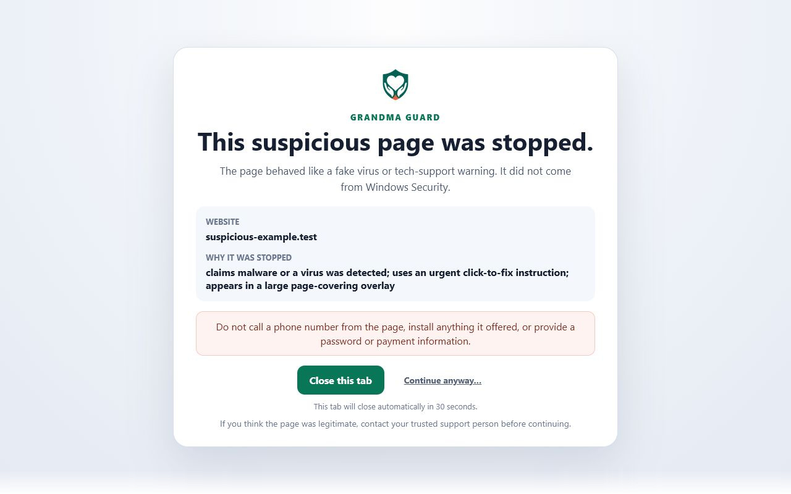

<p align="center">
  
</p>

<h1 align="center">Grandma Guard</h1>

<p align="center">
  Calm, local protection from fake virus alerts, notification traps, forced
  updates, phishing, and tech-support scams.
</p>

<p align="center">
  <a href="https://addons.mozilla.org/en-US/firefox/addon/grandma-guard/">
    
  </a>
  <a href="LICENSE">
    
  </a>
  
  
</p>

## What is Grandma Guard?

Grandma Guard is an open-source browser extension designed to stop
high-confidence scareware and deceptive web pages before someone can interact
with them.

It looks for combinations of suspicious claims, coercive instructions,
notification traps, fake support prompts, forced downloads, page-covering
overlays, and other risky behavior. It also considers context so that news
articles, security guides, quoted scam examples, and legitimate vendor websites
are less likely to trigger a false warning.

The extension was inspired by the creator's grandmother and the need for a
calm, understandable layer of protection for people who may not recognize
browser-based scams.

## Browser availability

| Browser | Status | Install or package |
| --- | --- | --- |
| Firefox | Published | [Install from Firefox Add-ons](https://addons.mozilla.org/en-US/firefox/addon/grandma-guard/) |
| Chrome | Package ready | `Grandma-Guard-Chrome-1.0.0.zip` |
| Opera | Package ready | `Grandma-Guard-Opera-1.0.0.zip` |

Chrome and Opera store packages are included with the release files. Firefox
uses its own Manifest V3 background configuration and stable add-on ID.

## What it can detect

- Fake virus, malware, infection, and damaged-device alerts
- Tech-support scams that pressure someone to call a phone number
- Notification prompts disguised as CAPTCHA or Continue buttons
- Fake browser, Windows, antivirus, and security update warnings
- Account-lock and identity-verification phishing
- Downloads presented as required cleaners, scanners, or protection tools
- Full-screen and page-covering scareware overlays
- Instructions that pressure the visitor not to close the page

Grandma Guard does not block a page because of one scary phrase. A block
requires stronger combinations of evidence or a high-confidence deception
pattern.

## What happens when a page is stopped?

Grandma Guard replaces the suspicious page with a calm warning that explains:

- which website was stopped;
- why it looked suspicious;
- what the visitor should avoid doing; and
- how to close the tab safely.

The tab closes automatically after 30 seconds. A less-prominent Continue path
requires a second confirmation and a five-second pause. If confirmed, it opens
only the exact address once and does not permanently trust the website.

<p align="center">
  
</p>

## Privacy by design

Grandma Guard performs its analysis inside the browser.

- No account is required.
- No analytics or telemetry are included.
- No browsing data is sent to the developer.
- No advertising or affiliate tracking is included.
- No remote JavaScript or downloaded configuration is used.
- Detection history stays in browser-local storage.
- The user can clear the local detection history at any time.

The extension stores up to 100 blocked hostnames with timestamps and detection
reasons. An exact blocked address is kept only briefly when needed for the
one-time Continue flow.

Read the full [privacy policy](PRIVACY_POLICY.md).

## Security design

- Readable, unminified source code
- No third-party runtime libraries
- No remote code execution
- Manifest V3 browser packages
- Limited `storage` permission
- Page access used only for local detection
- Short-lived, single-use bypass tokens
- Context-aware false-positive safeguards
- Automated syntax, manifest, packaging, and regression checks

Grandma Guard is a browser safety aid, not an antivirus. Keep the operating
system, browser, and trusted security software updated.

## Repository layout

```text
GrandmaGuard/
|-- source/        Shared Chrome and Opera extension source
|-- chrome/        Complete Chrome package contents
|-- firefox/       Complete Firefox package contents
|-- opera/         Complete Opera package contents
|-- tests/         Detection-engine regression tests
|-- tools/         Release and source-archive scripts
|-- branding/      Project logos
|-- store-assets/  Browser-store artwork
|-- BUILDING.md    Reproducible build instructions
`-- LICENSE        MIT License
```

## Build and test

Grandma Guard does not require npm packages, a bundler, minification, or network
access during the build.

Reference environment:

- Windows 11 Pro, build 26200
- Windows PowerShell 5.1
- Node.js 24.18.0

From the repository root:

```powershell
Set-ExecutionPolicy -Scope Process Bypass
.\tools\Build-Release.ps1
```

The release builder:

1. Synchronizes the shared source into all three browser folders.
2. Preserves and validates Firefox's browser-specific manifest.
3. Checks every JavaScript file for syntax errors.
4. Runs 25 detection regression cases.
5. Validates manifest assets and archive paths.
6. Rejects stale assets, development files, and em dashes.
7. Rebuilds and inspects the Chrome, Firefox, and Opera ZIP files.

See [BUILDING.md](BUILDING.md) for complete build and source-archive
instructions.

## Reviewing or contributing

The core detection logic is in
[`source/detection-engine.js`](source/detection-engine.js). Browser page
collection is handled by [`source/detector.js`](source/detector.js), and the
regression scenarios are in
[`tests/detection-engine.test.mjs`](tests/detection-engine.test.mjs).

When changing detection behavior:

1. Add or update a regression case.
2. Keep legitimate articles and security education pages in the test set.
3. Run the complete release build.
4. Confirm that Chrome, Firefox, and Opera still contain the same shared code.
5. Document any new permission or data-handling behavior.

Security reports should avoid publishing live malicious URLs, personal
information, or exploit details in a public issue.

## License

Grandma Guard is released under the [MIT License](LICENSE).

Copyright (c) 2026 NokaAngel.
