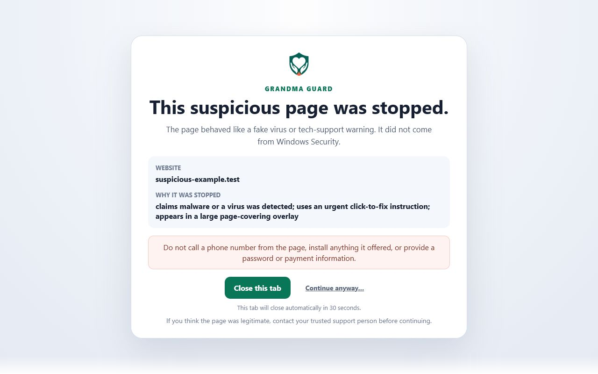

<p align="center">
  
</p>

<h1 align="center">Grandma Guard</h1>

<p align="center">
  Calm, local protection from fake virus alerts, notification traps, forced
  updates, phishing, and tech-support scams.
</p>

<p align="center">
  <a href="https://addons.mozilla.org/en-US/firefox/addon/grandma-guard/">
    
  </a>
  <a href="LICENSE">
    
  </a>
  <a href="https://github.com/NokaAngel/Grandma-Guard/actions/workflows/ci.yml">
    
  </a>
  
  
</p>

## What is Grandma Guard?

Grandma Guard is an open-source browser extension designed to stop
high-confidence scareware and deceptive web pages before someone can interact
with them.

It looks for combinations of suspicious claims, coercive instructions,
notification traps, fake support prompts, forced downloads, page-covering
overlays, and other risky behavior. It also considers context so that news
articles, security guides, quoted scam examples, and legitimate vendor websites
are less likely to trigger a false warning.

The extension was inspired by the creator's grandmother and the need for a
calm, understandable layer of protection for people who may not recognize
browser-based scams.

## Browser availability

| Browser | Status | Install or package |
| --- | --- | --- |
| Firefox | Published | [Install from Firefox Add-ons](https://addons.mozilla.org/en-US/firefox/addon/grandma-guard/) |
| Chrome | Release package | [Download from GitHub Releases](https://github.com/NokaAngel/Grandma-Guard/releases) |

Every GitHub Release includes verified Chrome and Firefox packages plus a
complete source archive. Firefox uses its own Manifest V3 background
configuration and stable add-on ID.

Opera is not listed separately. Opera users should install the Chrome Web Store
version.

## What's new in 2.0.0

Version 2.0.0 is a major update while staying fully local:

- Toolbar popup dashboard with weekly protection counts
- Link click, hover, paste, and short-link warnings
- Navigation guard for family blocklist and remembered bad link domains
- Shopping mode, 48-hour after-scam protection, and Grandma preset
- Expanded webmail support: Gmail, Outlook, Yahoo, Proton, AOL, iCloud, Zoho, Fastmail, and Tuta
- Plain-language scam tips when reading flagged emails
- Family blocklist, strict mode with caregiver PIN, and settings export/import

Full release history is in [CHANGELOG.md](CHANGELOG.md). Store version notes for Firefox are in [docs/FIREFOX_RELEASE_NOTES.md](docs/FIREFOX_RELEASE_NOTES.md).

## What it can detect

- Fake virus, malware, infection, damaged-device, and PC-locked alerts
- Tech-support scams that pressure someone to call a phone number
- Scrambled, deep-subdomain, and brand-impersonating hostnames used with scare pages
- Fake support or report desktop-app downloads and remote-access tool pressure
- Fake Amazon, PayPal, and bank login or account-verification pages
- Suspicious links and fake reward or prize emails inside supported webmail (Gmail, Outlook, Proton, Yahoo, AOL, iCloud, Zoho, Fastmail, and Tuta), marked with Possible scam highlights and hover reasons
- Notification prompts disguised as CAPTCHA or Continue buttons
- Fake browser, Windows, antivirus, and security update warnings
- Account-lock and identity-verification phishing
- Downloads presented as required cleaners, scanners, or protection tools
- Full-screen and page-covering scareware overlays
- Instructions that pressure the visitor not to close the page

Grandma Guard does not block a page because of one scary phrase. A block
requires stronger combinations of evidence or a high-confidence deception
pattern.

## What happens when a page is stopped?

Grandma Guard replaces the suspicious page with a calm warning that explains:

- which website was stopped;
- why it looked suspicious;
- what the visitor should avoid doing; and
- how to close the tab safely.

The tab closes automatically after 30 seconds. A less-prominent Continue path
requires a second confirmation and a five-second pause. If confirmed, it opens
only the exact address once and does not permanently trust the website.

<p align="center">
  
</p>

## Privacy by design

Grandma Guard performs its analysis inside the browser.

- No account is required.
- No analytics or telemetry are included.
- No browsing data is sent to the developer.
- No advertising or affiliate tracking is included.
- No remote JavaScript or downloaded configuration is used.
- Detection history stays in browser-local storage.
- Email scam highlights and reasons stay on the device.
- The user can clear the local detection history at any time.

The extension stores up to 100 blocked hostnames with timestamps and detection
reasons. An exact blocked address is kept only briefly when needed for the
one-time Continue flow.

Read the full [privacy policy](docs/privacy/PRIVACY_POLICY.md).

## Security design

- Readable, unminified source code
- No third-party runtime libraries
- No remote code execution
- Manifest V3 browser packages
- Limited `storage` and `webNavigation` permissions
- Page access used only for local detection
- Short-lived, single-use bypass tokens
- Context-aware false-positive safeguards
- Automated syntax, manifest, packaging, and regression checks

Grandma Guard is a browser safety aid, not an antivirus. Keep the operating
system, browser, and trusted security software updated.

## Repository layout

```text
GrandmaGuard/
|-- extension/  One shared source tree and two browser manifests
|-- assets/     Project branding and browser-store artwork
|-- docs/       Submission notes, listing copy, and privacy policies
|-- tests/      Detection-engine regression tests
|-- tools/      Release and source-archive scripts
|-- .github/    Validation and browser-store release automation
|-- dist/       Generated packages, ignored by Git
|-- BUILDING.md Reproducible build instructions
`-- LICENSE     MIT License
```

## Build and test

Grandma Guard does not require npm packages, a bundler, minification, or network
access during the build.

Reference environment:

- Windows 11 Pro, build 26200
- Windows PowerShell 5.1
- Node.js 24.18.0

From the repository root:

```powershell
Set-ExecutionPolicy -Scope Process Bypass
.\tools\Build-Release.ps1 -Browser All
```

Use `-Browser Chrome` or `-Browser Firefox` to build only one package.
Omitting `-Browser` builds both.

The release builder:

1. Creates temporary Chrome and Firefox staging folders.
2. Applies the appropriate Chromium or Firefox manifest.
3. Checks every JavaScript file for syntax errors.
4. Runs the detection and email-link regression suite.
5. Validates manifest assets and archive paths.
6. Rejects stale assets, development files, and em dashes.
7. Writes the verified browser ZIPs to `dist`.
8. Removes the temporary staging folders automatically.

See [BUILDING.md](BUILDING.md) for complete build and source-archive
instructions.

## Automated releases

Normal pushes and pull requests build and validate the Chrome and Firefox
packages. Publishing a GitHub Release with a matching version tag, such as
`v2.0.0`, then:

1. Rebuilds Chrome, Firefox, and source archives from the tagged code.
2. Attaches the verified ZIP files to the GitHub Release.
3. Submits the Chrome package when Chrome publishing is enabled.
4. Submits the Firefox package to AMO when Firefox publishing is enabled.

Store credentials are kept in GitHub's encrypted `browser-stores` environment
and are never committed to the repository. See
[Automated browser-store deployment](docs/DEPLOYMENT.md) for the one-time
setup and release checklist.

## Reviewing or contributing

The core detection logic is in
[`extension/detection-engine.js`](extension/detection-engine.js). Browser page
collection is handled by
[`extension/detector.js`](extension/detector.js), and the
regression scenarios are in
[`tests/detection-engine.test.mjs`](tests/detection-engine.test.mjs).

When changing detection behavior:

1. Add or update a regression case.
2. Keep legitimate articles and security education pages in the test set.
3. Run the complete release build.
4. Confirm that Chrome and Firefox still contain the same shared code.
5. Document any new permission or data-handling behavior.

Security reports should avoid publishing live malicious URLs, personal
information, or exploit details in a public issue.

## License

Grandma Guard is released under the [MIT License](LICENSE).

Copyright (c) 2026 NokaAngel.
